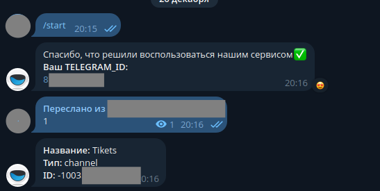
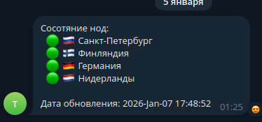

# Telegram-Бот для мониторинга состояния НОД через RemnawaveAPI

Бот обращается к панели с заданным интервалом, получает статусы подключения НОД и отправляет в указанный чат.

## Настройка

### Заполнение файла конфигурации
Скопируйте .env.example

```BASH
cp .env.example .env
```

Заполните 

```ini
REMNAWAVE_INTERVAL=1 # Период проверки состояния нод в секундах

REMNAWAVE_HOST=""    # Домен панели Remnawave 
REMNAWAVE_TOKEN=""   # Токен из настроек панели Remnawave 
REMNAWAVE_COOKIE=""  # COOKIE из https://{host}/auth/login?{COOKIE}

TELEGRAM_TOKEN=      # Токен бота
TELEGRAM_CHAT_ID=    # Идентификатор чата
``` 

### Получение API-токена Remnawave

Перейдите в настройки Remnawave


Создайте токен в разделе с токенами API


### Получение API-токена Telegream

Перейдите в [BotFather](https://t.me/BotFather/createbot) и создайте бота `/newbot`

### Определение ID чата

Бот может отправлять сообщения в:
- Канал, если он там состоит и является его администратором
- Личные сообщения, если получатель предаврительно начинал с ним диалог

Определить id чата можно несколькими способами:
- Через BotApi, поулчив сообщение в интересующем чате из метаданных запроса.
- Использовать стороннего бота, например: [Get my ID](https://t.me/FIND_MY_ID_BOT). На сообщение `/start` он пришлет ваш ID. Если нужен id канала - то можно переслать любое сообщение из него, тогда бот пришлет вам id канала.



### Что за COOKIE?

Если панель установлена через скрипт от (egam.es)[https://wiki.egam.es/ru/installation/panel-only/] - страница панели защищена секретным ключом.
При установке скрипт даёт ссылку на доступ к панели:
`https://p.example.com/auth/login?SECRET_KEY=SECRET_KEY`
Из этой ссылки `SECRET_KEY=SECRET_KEY` и есть наши COOKIE. 


## Запуск 

```bash
source .env
./remnawave_node_monitor
```

## Автозапуск
Создать файл в /etc/systemd/system/remnawave_node_monitor.service
```systemctl
[Unit]
Description=RemnawaveNodeMonitor
After=network.target

[Service]
Type=simple
User=root
WorkingDirectory=/opt/RemnawaveNodeMonitor
EnvironmentFile=/opt/RemnawaveNodeMonitor/.env
ExecStart=/opt/RemnawaveNodeMonitor/remnawave_node_monitor
StandardOutput=append:/var/log/remnawave_node_monitor.log
StandardError=append:/var/log/remnawave_node_monitor-error.log
Restart=on-failure
RestartSec=2

[Install]
WantedBy=multi-user.target
```

## Результат

Бот бесконечно обновляет последнее отправленное сообщение в чат. Если его перезапустить, то он потеряет id сообщения и пришлёт новое. Старое можно будет удалить.


